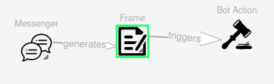
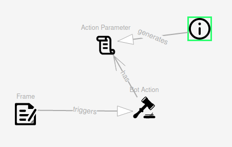
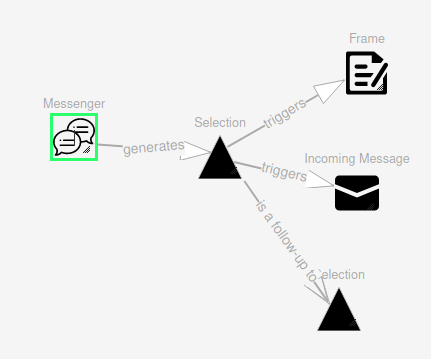
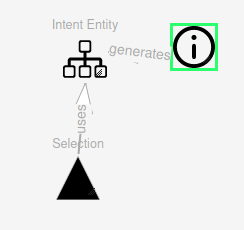
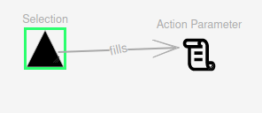

# Social-Bot-Framework


Core Components
--------
* [las2peer-Social-Bot-Manager-Service](https://github.com/rwth-acis/las2peer-Social-Bot-Manager-Service)

External Dependencies
--------
* [y-websockets-server](https://github.com/y-js/y-websockets-server)
* [SyncMeta](https://github.com/rwth-acis/syncmeta)
* [MobSOS Data-Processing](https://github.com/rwth-acis/mobsos-data-processing)
* [MobSOS Success-Modeling](https://github.com/rwth-acis/mobsos-success-modeling)
* [Rasa](https://github.com/RasaHQ/rasa.git)

Backend Integration
--------
### Trigger
For the bot to be triggered, the service must send an appropriate [monitoring message](https://github.com/rwth-acis/mobsos-data-processing/wiki/Manual#2-monitor-a-service).
```json
{
    "serviceAlias": "",
    "functionName": "",
    "attributes":{}
}
```
The `serviceAlias` attribute should contain the alias given by the @ServicePath annotation. 
The `functionName`attribute should contain the name of the function. 
Any type of attributes (@PathParam/@QueryParam/@BodyParam) should be listed in the `attributes` attribute.
If the service uses [PoJo's](https://en.wikipedia.org/wiki/Plain_old_Java_object) the developer can make use of the [Gson library](https://github.com/google/gson). 


# SBF Utilities Frontend

This application provides helpers to interact with the Social Bot Manager service.

This frontend consists of the Bot Modeling and the NLU Model Training Helper. 

## Build and Run the Frontend
First build the Docker image
```
$ docker build -t rwthacis/sbf-utils .
```

Then you can start the container like this:
```
$ docker run -p 8070:8070 -e WEBHOST=<host_address> -e YJS=<yjs_address> -e OIDC_CLIENT_ID=<oidc_client_id> -e RASA_NLU=<rasa_server> -e SBF_MANAGER=<sbfmanager_address> -d rwthacis/sbf-utils
```
After container started to run, application will be accessible via http://127.0.0.1:8070

Application is using [YJS][yjs-github] for interwidget communication, therefore it needs [y-websocket-server][y-websocket-server] instance. 
It can be started with following command:
```
docker run -p 1234:1234  -d rwthacis/y-websockets-server
```
Then, address of y-websockets-server instance need to be passed to Docker container during initialization with `YJS` environment variable. If websocket server is started with previous command, its address will be `127.0.0.1:1234` and this value need to be passed to Docker container during initialization.


Following environment variables are needed to be passed to container during initialization:

* `WEBHOST`: Url address of application
* `YJS`: Root url address of Yjs websocket server. If it is running behind reverse proxy, relative path need to be provided with the `YJS_RESOURCE_PATH` env variable.
* `OIDC_CLIENT_ID`: OIDC client id which is used for authentication purpose. Client id can be acquired from Learning Layers after client registration

Following environment variables have default values however they can be changed during initialization:

* `PORT`: Port which Nginx server is listening locally. This port need to be made accessible to outside with port mapping during initialization. Default value is `8070`.
* `YJS_RESOURCE_PATH`: Resource path of Yjs websocker server. If websocket server running behind reverse proxy and `/yjs` path is redirected to websocket server, this env variable need to be `/yjs/socket.io`. Default value is `/socket.io`.
* `SBF_MANAGER`: Address of a running SBFManager Instance. If not empty, the given address will be written in the "SBFManager Endpoint" fields of the frontend.
* `RASA_NLU`: Address of a server hosting the NLU Model. If not empty, the given address will be written in the "Rasa NLU Endpoint" field of the NLU Model Training Helper.

[yjs-github]: https://github.com/yjs/yjs
[y-websocket-server]: https://github.com/y-js/y-websockets-server

# Deploying a Bot
After creating a bot model on the frontend, you will be able to upload the bot to the SBFManager by using the "Model Uploader" on the "Bot Modeling" page. For this to work, you will need a running instance of the [SBFManager](https://github.com/rwth-acis/las2peer-Social-Bot-Manager-Service) and adjust the "SBFManager Endpoint" accordingly. 

When creating chatbots you will also need to provide a [Rasa server](https://github.com/RasaHQ/rasa.git) hosting a NLU Model. You can also use the "NLU Model Training Helper" to create your own NLU Model and upload that model by adjusting the "SBFManager Endpoint" and "Rasa NLU Endpoint" accordingly.

# Bot-modeling Guide
### A Bot's Basic Configuration
First, to be able to deploy the bot (on a running instance of the [SBFManager](https://github.com/rwth-acis/las2peer-Social-Bot-Manager-Service), we will need to connect an Instance element to a Bot element with the "has" relation.   
  
The Instance element will represent the las2peer instance on which our used services are running and on which our bot will be acting. For the attributes, an arbitrary name can be given and the address of the las2peer instance is also needed. There is also the optional attribute "Environment Separator", which can be used if multiple subcategories are defined in the instance. The Bot element will only need a name, with which the las2peer network will identify the created bot with.
When creating a Chatbot, some additional elements are needed. These will be the NLU Knowledge element and the Messenger element. The Bot element will use the "has" relation to connect to both of these elements.   
   
The NLU Knowledge element represents the bot's used NLU Model(language model), thus the bot's vocabulary. As attributes, the NLU Knowledge element will need an arbitrary name, the address of the Rasa server hosting the NLU Model, and an ID to differentiate between multiple NLU Models, as a bot can possess multiple NLU Models. The Messenger element will represent the used communication platform, for which the platforms Slack and Rocket.Chat are currently available. After setting a platform as an attribute, an additional authentication token will be needed which should be provided by the platforms themselves.
### Modelling Chatbot-User Interaction
Now that we have a bot that is ready to be deployed, we still need to model the conversation itself. The SBF will allow us to create the bot's NLU Model, thus how it will interpret the user's messages and we will be able to let the bot respond with fitting messages depending on the user's message.  
First things first, the user will need to model the bot's NLU Model in the "NLU Model Training Helper" part of the SBF frontend. The Markdown format is used for creating the NLU Models and a precise tutorial can be found at [Rasa's official documentation](https://legacy-docs-v1.rasa.com/nlu/training-data-format/). Overrall, here the user will define the Intents the bot will be able to recognize based on given examples. To upload the NLU Model, the SBF Manager endpoint and the Rasa NLU Endpoint need to be adjusted accordingly. The model will first be trained and thus not be immediately available. One can check the training's state by pressing the "Check Training Status" button.    
The Incoming Message and Chat Response elements are used for modelling the conversation.  
   
At the beginning of a conversation, the bot will wait for the user's message. After the bot receives a message on the chat platform, it will attempt to extract an Intent from the received message. The Incoming Message element will represent the user's messages and has an Intent attribute, which will contain the expected Intent. If the bot recognizes this Intent, the bot will go to this Incoming Message element and trigger the corresponding Chat Response. The Chat Response element thus represents the bot's response to user messages for which the concrete response can be written in the "Message" attribute field of the element.    
 For an easy example, lets say we modelled the bot to expect a greeting from the user and great them back. For that cause, the "greeting" Intent was defined in the NLU Model. Additionally, the Intent attribute of the Incoming Message element will contain "greeting" and the Chat Response's "Message" attribute will contain the message "Hello :)". If the user now greets the bot, the bot will extract the "greeting" Intent and jump to the fitting Incoming Message element and then greet the user back with "Hello :)".
An additional option is to let the bot use multiple Chat Response elements for one Incoming Message element. This would simply lead to the bot randomly choosing one of the available Chat Responses to give to the user, making the bot a bit more interactive.  
  

Adding an Incoming Message with the Intent attribute set to "default" would lead to the bot giving out a default answer if it does not understand a message (i.e. having a low confidence when extracting the Intent).

### Modelling Chatbot-User Interaction: Creating a Conversation Path
After a first chat-interaction with the bot, there also is the possibility to create a conversation path, which will make the bot wait for specific Intents and trigger Chat Responses which could be triggered in this conversation path and not from the initial state of the conversation. To create a conversation path, the "leadsTo" relation can be used between Incoming Message elements, where the "label" attribute of the "leadsTo" relation must contain the follow up Intent.     

 

The Intent attribute of the follow up Incoming Message elements can remain empty as the leadsTo relation will take care of forwarding the state. For these messages to be reachable from the initial state, the Messenger will again need to connect to these elements using the "generates" relation and the elements will also need to have the Intent attribute set. Once there is no follow up message the conversation path will be quit and the conversation will go back to the initial state. If no fitting Intent is recognized, the bot will simply send the default message.   
Continuing the previous greeting example, the user could have changed the bot's initial message to "Hello :), how was your day?". To model a fitting response, the user added the Intents "positiv" & "negativ", added new Incoming Message elements with the leadsTo relation and added Chat Responses with fitting answers. The bot would now, after asking the user about their day, expect a positiv or negativ answer and respond accordingly. 

### Create communication state with service
There is the possiblity to let users communicate and send messages to a specific triggered service for a certain period of time, depending on the service.
During this communication state the service will receive every user message and also have the possibility to communicate with the user. 
To model this you need to do the following:
- Have an incoming message object trigger a chat response object
- The chat response object will contain no message 
- The chat response object will be connect to a bot action object with the "uses" relation
- The bot action will now be the service with which the user will communicate


The service will need to respond to the request with a json file containing the following data: 
```json
{
    "text": "",
    "closeContext": ""
}
```
The `text` attribute represents the service's response to the user.

The `closeContext` attribute is a boolean value which informs the Social Bot Manager if the communication state is to be maintained or stopped. (Note that, if no closeContext attribute is found, the communication state will automatically be stopped.)


# Bot Menu

At the beginning of a dialogue, the bot will introduce himself. Therefore the bot will generate a list of possible commands given by the frames and selections that are connected to the messenger or a domain. To use this the command name has to be defined in the element, otherwise, the element is ignored.

We have three basic dialogue elements that can be combined to model a dialogue. The Incoming Message assigns chat responses to user intents, the Selection that gives the user responses to choose from, the Frame that generates an information collecting sub dialogue related to an action.

# Modelling Elements

## Instance
VLE Instance
 - **Name**: (optional)
 - **Address**: URL address 

## Bot

 - **Name**: Name of your bot. Used to identify your bot inside social bot manager service.
 - **Description**: Description of your bot (optional). Used to generate the Bot Menu.

## Knowledge
 
The Knowledge element registers external NLU Modules. / Defines the internal NLG Module.

 ### Attributes
 
 - **Type**: Defines if Knowledge refers to Language Understanding or Language Generation. Default: Understanding
 - **Name**: Name of the NLU Module 
 -  **ID**: Identification of the Knowledge Module (optional)
 -  **URL**: URL Address of the external server.
 ### Associations

- ***triggers***: Incoming Message

## Incoming Message
 
 The Incoming Message can Trigger 

 ### Attributes
 
 - **Intent Keyword**: Related to NLU Module. Triggers Dialogue.
 - **Response Message**: Message that the Bot answers after the Intent Keyword is identified.

 ### Associations

- ***triggers***: Chat Response

## Frame

An element that triggers a Bot Action. Enables automatic parameter filling. Shown in the Bot Menu.

 ### Attributes

 - **Intent Keyword**: Related to NLU Module. Triggers Dialogue.
 - **Success Response**: Message that the Bot answers if the Service Access is successful (optional). Default: The Service Access Response.
 - **Error Response**: Message that the Bot answers if the Service Access is not successful (optional). Default: The Service Access Response.

 - **Operation Name**: Command Name (optional). Displayed in the Bot Menu. Default: Intent Keyword.
 - **Operation Description**: Command Description (optional). Displayed in the Bot Menu.

 ### Associations

- ***triggers***: Bot Action
-  ***fills***: Action Parameter

## Selection

The Selection allows offering answer possibilities.

 ### Attributes

 - **Intent Keyword**: Related to NLU Module. Triggers Dialogue.
- **Response Message**: Message that the Bot answers after the Intent Keyword is identified.

 - **Operation Name**: Command Name (optional). Displayed in the Bot Menu. Default: Intent Keyword.
 - **Operation Description**: Command Description (optional). Displayed in the Bot Menu.

 ### Associations

- ***triggers***: Incoming Message
- ***triggers***: Chat Response
- ***triggers***: Frame
-  ***precedes***: Selection
- ***fills***: Action Parameter
- **uses***: Intent Entity


## Bot Action
 
Action the Bot should perform.

 ### Attributes
 
 - **Type**: The Type of Bot Action:
	 - Service: Access las2peer Service
	 - OpenAPI: Access OpenAPI documented Service
 - **Function Name**: Operation Name corresponding to OpenAPI documentation.
 - **Service Alias**: Service Alias of las2peer service / service URL of OpenAPI service.

 ### Associations

- ***has***: Action Parameter

## Action Parameter
 
Parameter of a Service Function

 ### Attributes
  
 - **ParameterType**: Type of Parameter
	 - Path: Path Parameter
	 - Query: Query Parameter
	 - Body: Body Parameter
	 - Child: Sub Paramter of Body Parameter
 -  **Name**: Name of Parameter. Refers to OpenAPI Documentation. Used to identify parameter when merging.
 - **ContentType**: Content Type that the Parameter accepts
 - **Content**: (optional) Static value to fill this parameter
 - **Format**: (optional) Format that this parameter accepts
 - **URL**: (optional) URL address to receive information about this parameter.
 - **URL Key**: (optional) Keyword to identify values in a JSON response.
 - **Key Fill**: (optional) Fill parameter

## Info Function
 
Service Access to receive Information

 ### Attributes
 
 - **Type**: The Type of Bot Action:
	 - Service: Access las2peer Service
	 - OpenAPI: Access OpenAPI documented Service
 - **Function Name**: Operation Name corresponding to OpenAPI documentation.
 - **Service Alias**: Service Alias of las2peer service / service URL of OpenAPI service.

 ### Associations

- ***has***: Action Parameter
- ***generates***: Selection
- ***generates***: Incoming Message
- ***generates***: Intent Entity


## Domain
 
Domain to group Dialogue Elements

 ### Attributes
 
 - **Name**: Name of Domain. Used in Bot Menu.
 - **Description**: (optional) Description of Domain. Used in Bot Menu.

 ### Associations

- ***has***: Incoming Message
- ***has***: Selection
- ***has***: Frame
- 
## Service

This Element defines a Web Service

 ### Attributes
 
 - **Type**: Related to NLU Module. Triggers Dialogue.
 - **Service Alias**: Message that the Bot answers after the Intent Keyword is identified.
 - **Service URL**: Message that the Bot answers after the Intent Keyword is identified.
 - **Swagger URL**: Message that the Bot answers after the Intent Keyword is identified.

 ### Associations

- ***has***: Bot Action
- ***has***: Info Function
- ***has***: Service Event

## Service Event
 
An event that is triggered by a service

 ### Attributes
 
 - **Name**: Name of Event
 
 ### Associations

- ***triggers***: Chat Response
- 
## Intent Entity
 
Intent Entity 

 ### Attributes
 
 - **Name**: Name of Entity
 - 
## File
 
Represents a File

 ### Attributes
 
 - **Name**: Name of File
 -  **Type**: Type of File 
 
 ### Associations

- ***generates***: Action Parameter

# Design Pattern

## Service Access Function

### Auto Generated

For a basic Service Access Action, a **Frame** needs to **trigger** a **Bot Action**. If a frame triggers a bot action it automatically recognizes its parameters (also non modeled parameters, if open API documentation is available). and creates a dialogue that tries to ask the user for the values of the parameters. 



### With Custom Parameter Information

To give additional information about the Parameters a **Bot Action** can **has** one or multiple **Action Parameter**. The modeled parameters can be used to give further instructions to the dialogue generation. The System will use the Action Parameter Name to identify the corresponding parameter in the OpenAPI specification. If such a parameter can be identified, the parameter information from the model is merged into the parameter information received from the OpenAPI Specification. 

#### Static Content

if the Content Attribute is filled with a value, the Bot Action is always performed with this exact value. As a Consequence, the Bot does not ask for this parameter during the filling dialogue.

#### Dynamic Enums
You can define a set of Values that is applicable for the parameter that is received from a Service Function. For this, you can either use the URL and URL Key Attribute. Or **Info Function** **generates** the **Action Parameter**. If a parameter is generated by an info function, the frame interprets the result of the info function as a list of possible values (like a selection). The label of the generates association defines the key to interpret the JSON response. 



#### Dynamic Enums  With Parameters

The info function may have also parameters that need to be filled. If this is the case the Frame will by default include them in the dialogue. Often the required parameter is also part of the Bot Actions parameters. If this is the case you can link both parameters by modeling **Frame** **fills** the **Action Parameter**.  As the Label of the fill Association, you have to choose the parameter name of the Bot Action. Alternative a **Selection** may fill the **Action Parameter**.

One common design pattern would be to use the Info function to receive existing objects and use them in the bot action to alter one of these objects. Another design pattern would be to get the existing objects and use them as a filter in the request of another bot action. The info function may have

#### Dynamic Format

To override the Format in the OpenAPI Specification you can use the Format Attribute. You can also define a dynamic format that is received by an Info Function.


## Selections

### Basic Selection



The selection asks the user to choose from a collection of possible answers. It can be connected to one or multiple frames, messages, or further selections. It will generate the possible answers from the label of the associations to the other elements and trigger the element if the user chooses the respective input.

### Dynamic Selection

The answer possibilities can be dynamically received by a function call. For this a **Selection** ***uses*** an **Intent Entity** and a **Info Function** ***generates*** the **Intent Entity**. You can define which section of a response JSON the selection should use by writing its Key on the label of the generates association.



### Filling Parameters

The selected value of a Selection can be used to fill the Parameters of descendant attributes in the dialogue tree.
For this, use the ***fills*** association between the **Selection** and the **Action Attribute**




