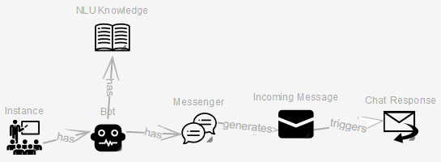
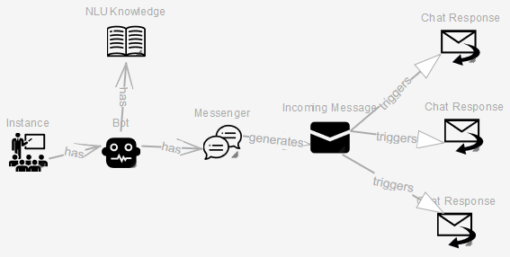
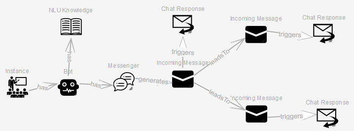
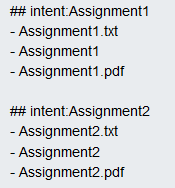

# Social-Bot-Framework

## Core Components

* [las2peer-Social-Bot-Manager-Service](https://github.com/rwth-acis/las2peer-Social-Bot-Manager-Service)

## External Dependencies

* [y-websockets-server](https://github.com/y-js/y-websockets-server)
* [SyncMeta](https://github.com/rwth-acis/syncmeta)
* [MobSOS Data-Processing](https://github.com/rwth-acis/mobsos-data-processing)
* [MobSOS Success-Modeling](https://github.com/rwth-acis/mobsos-success-modeling)
* [Rasa](https://github.com/RasaHQ/rasa.git)

## Backend Integration

### Trigger

For the bot to be triggered, the service must send an appropriate [monitoring message](https://github.com/rwth-acis/mobsos-data-processing/wiki/Manual#2-monitor-a-service).

```json
{
    "serviceAlias": "",
    "functionName": "",
    "attributes":{}
}
```

The `serviceAlias` attribute should contain the alias given by the @ServicePath annotation. 
The `functionName`attribute should contain the name of the function. 
Any type of attribute (@PathParam/@QueryParam/@BodyParam) should be listed in the `attributes` attribute.
If the service uses [PoJo's](https://en.wikipedia.org/wiki/Plain_old_Java_object) the developer can make use of the [Gson library](https://github.com/google/gson).

## SBF Utilities Frontend

This application provides helpers to interact with the Social Bot Manager service.

This frontend consists of the Bot Modeling and the NLU Model Training Helper. 

### Build and Run the Frontend

First, build the Docker image

```bash
$ docker build -t rwthacis/sbf-utils .
```

Then you can start the container like this:

```bash
$ docker run -p 8070:8070 -e WEBHOST=<host_address> -e YJS=<yjs_address> -e OIDC_CLIENT_ID=<oidc_client_id> -e RASA_NLU=<rasa_server> -e SBF_MANAGER=<sbfmanager_address> -d rwthacis/sbf-utils
```

After the container started to run, the application will be accessible via http://127.0.0.1:8070

Application is using [YJS][yjs-github] for interwidget communication, therefore it needs [y-websocket-server][y-websocket-server] instance. 
It can be started with the following command:

```bash
$ docker run -p 1234:1234  -d rwthacis/y-websockets-server
```

Then, the address of y-websockets-server instance needs to be passed to Docker container during initialization with `YJS` environment variable. If the WebSocket server is started with the previous command, its address will be `127.0.0.1:1234` and this value needs to be passed to Docker container during initialization.


Following environment variables are needed to be passed to the container during initialization:

* `WEBHOST`: Url address of application
* `YJS`: Root URL address of Yjs WebSocket server. If it is running behind a reverse proxy, a relative path needs to be provided with the `YJS_RESOURCE_PATH` env variable.
* `OIDC_CLIENT_ID`: OIDC client id which is used for authentication purposes. Client id can be acquired from Learning Layers after client registration

Following environment variables have default values however they can be changed during initialization:

* `PORT`: Port which Nginx server is listening locally. This port need to be made accessible to the outside with port mapping during initialization. The default value is `8070`.
* `YJS_RESOURCE_PATH`: Resource path of Yjs WebSocket server. If the WebSocket server is running behind a reverse proxy and the `/yjs` path is redirected to the WebSocket server, this env variable needs to be `/yjs/socket.io`. The default value is `/socket.io`.
* `SBF_MANAGER`: Address of a running SBFManager Instance. If not empty, the given address will be written in the "SBFManager Endpoint" fields of the frontend.
* `RASA_NLU`: Address of a server hosting the NLU Model. If not empty, the given address will be written in the "Rasa NLU Endpoint" field of the NLU Model Training Helper.

[yjs-github]: https://github.com/yjs/yjs
[y-websocket-server]: https://github.com/y-js/y-websockets-server

## Deploying a Bot

After creating a bot model on the frontend, you will be able to upload the bot to the SBFManager by using the "Model Uploader" on the "Bot Modeling" page. For this to work, you will need a running instance of the [SBFManager](https://github.com/rwth-acis/las2peer-Social-Bot-Manager-Service) and adjust the "SBFManager Endpoint" accordingly. 

When creating chatbots you will also need to provide a [Rasa server](https://github.com/RasaHQ/rasa.git) hosting an NLU Model. You can also use the "NLU Model Training Helper" to create your own NLU Model and upload that model by adjusting the "SBFManager Endpoint" and "Rasa NLU Endpoint" accordingly.

## Bot-modeling Guide

### A Bot's Basic Configuration

First, to be able to deploy the bot (on a running instance of the [SBFManager](https://github.com/rwth-acis/las2peer-Social-Bot-Manager-Service), we will need to connect an Instance element to a Bot element with the "has" relation.   
  
The Instance element will represent the las2peer instance on which our used services are running and on which our bot will be acting. For the attributes, an arbitrary name can be given and the address of the las2peer instance is also needed. There is also the optional attribute "Environment Separator", which can be used if multiple subcategories are defined in the instance. The Bot element will only need a name, with which the las2peer network will identify the created bot.
When creating a Chatbot, some additional elements are needed. These will be the NLU Knowledge element and the Messenger element. The Bot element will use the "has" relation connecting both of these elements.

The NLU Knowledge element represents the bot's used NLU Model(language model), thus the bot's vocabulary. As attributes, the NLU Knowledge element will need an arbitrary name, the address of the Rasa server hosting the NLU Model, and an ID to differentiate between multiple NLU Models, as a bot can possess multiple NLU Models. The Messenger element will represent the used communication platform, for which the platforms Slack and Rocket.Chat are currently available. After setting a platform as an attribute, an additional authentication token will be needed which should be provided by the platforms themselves.

### Modelling Chatbot-User Interaction

Now that we have a bot that is ready to be deployed, we still need to model the conversation itself. The SBF will allow us to create the bot's NLU Model, thus how it will interpret the user's messages and we will be able to let the bot respond with fitting messages depending on the user's message.  
First things first, the user will need to model the bot's NLU Model in the "NLU Model Training Helper" part of the SBF frontend. The Markdown format is used for creating the NLU Models and a precise tutorial can be found at [Rasa's official documentation](https://legacy-docs-v1.rasa.com/nlu/training-data-format/). Overall, here the user will define the Intents the bot will be able to recognize based on given examples. To upload the NLU Model, the SBF Manager endpoint and the Rasa NLU Endpoint need to be adjusted accordingly. The model will first be trained and thus not be immediately available. One can check the training's state by pressing the "Check Training Status" button.
The Incoming Message and Chat Response elements are used for modeling the conversation.  
   
At the beginning of a conversation, the bot will wait for the user's message. After the bot receives a message on the chat platform, it will attempt to extract an Intent from the received message. The Incoming Message element will represent the user's messages and has an Intent attribute, which will contain the expected Intent. If the bot recognizes this Intent, the bot will go to this Incoming Message element and trigger the corresponding Chat Response. The Chat Response element thus represents the bot's response to user messages for which the concrete response can be written in the "Message" attribute field of the element.
 For an easy example, let us say we modeled the bot to expect a greeting from the user and greet them back. For that cause, the "greeting" Intent was defined in the NLU Model. Additionally, the Intent attribute of the Incoming Message element will contain "greeting" and the Chat Response's "Message" attribute will contain the message "Hello :)". If the user now greets the bot, the bot will extract the "greeting" Intent and jump to the fitting Incoming Message element and then greet the user back with "Hello :)".
An additional option is to let the bot use multiple Chat Response elements for one Incoming Message element. This would simply lead to the bot randomly choosing one of the available Chat Responses to give to the user, making the bot a bit more interactive.  
  

Adding an Incoming Message with the Intent attribute set to "default" would lead to the bot giving out a default answer if it does not understand a message (i.e. having low confidence when extracting the Intent).

### Modelling Chatbot-User Interaction: Creating a Conversation Path

After a first chat interaction with the bot, there also is the possibility to create a conversation path, which will make the bot wait for specific Intents and trigger Chat Responses that could be triggered in this conversation path and not from the initial state of the conversation. To create a conversation path, the "leadsTo" relation can be used between Incoming Message elements, where the "label" attribute of the "leadsTo" relation must contain the follow-up Intent.



The Intent attribute of the follow-up Incoming Message elements can remain empty as the leadsTo relation will take care of forwarding the state. For these messages to be reachable from the initial state, the Messenger will again need to connect to these elements using the "generates" relation and the elements will also need to have the Intent attribute set. Once there is no follow-up message the conversation path will be quit and the conversation will go back to the initial state. If no fitting Intent is recognized, the bot will simply send the default message. If one of the leadsTo relations is empty, this path will be taken if no fitting Intent was found while in a conversation.
Continuing the previous greeting example, the user could have changed the bot's initial message to "Hello :), how was your day?". To model a fitting response, the user added the Intents "positive" & "negative", added new Incoming Message elements with the leadsTo relation and added Chat Responses with fitting answers. The bot would now, after asking the user about their day, expect a positive or negative answer and respond accordingly.

### File Messages

In addition to modeling simple textual responses, it is also possible to let the bot send a file to the user as a response. For that purpose, the Chat Response Element contains two additional attributes called "FileURL" and "ErrorMessage". FileURL should simply contain the URL to the file's download page. ErrorMessage should simply contain a message, which will be sent to the user in case an error occurs when retrieving the file.
Currently, the placeholder "menteeEmail" is available for the FileURL attribute. If "menteeEmail" is contained in the FileURL, it will be replaced by the user's email address.

### Create communication state with service

There is the possibility to let users communicate and send messages to a specific triggered service for a certain period of time, depending on the service.
During this communication state, the service will receive every user message and also have the possibility to communicate with the user.
To model this you need to do the following:

* Have an incoming message object trigger a chat response object
* The chat response object will contain no message 
* The chat response object will be connected to a bot action object with the "uses" relation
* The bot action will now be the service with which the user will communicate


The service will need to respond to the request with a json file containing the following data: 

```json
{
    "text": "",
    "closeContext": ""
}
```

The `text` attribute represents the service's response to the user.

The `closeContext` attribute is a boolean value that informs the Social Bot Manager if the communication state is to be maintained or stopped. (Note that, if no closeContext attribute is found, the communication state will automatically be stopped.)

### Sending Files to a Service

When modeling the conversation between bot and user, there is also the possibility to let the bot expect files from a user. To be precise, a user could trigger a service by sending a file, which would get forwarded to the service for further processing. Let us take our communication state from before and presume that the Bot Action Element is a service that expects a file:


In this case, we would like the service to be triggered only if a file was sent. To do this, we have the "IsFile" bool attribute in the Incoming Message Element. If the IsFile attribute is checked and no Intent is given, then the Bot Action will be triggered regardless of the file's name (given that a file was sent). If an Intent is given, then Intent extraction will be done on the file's name and see if the extracted Intent corresponds to the Intent given as an attribute in the Incoming Message Element. This for example allows the bot to understand specific file name formats, such as the following:



If a file is sent to a triggered service, it will first be encoded into base64 encoding. Afterwards, the JSON body sent to the triggered service will contain the following attributes:

```json
{
    "fileBody": "String of base64 encoding",
    "fileName": "String",
    "fileType": "String"
}
```

Note that if a service wants to send a file to a user, it will also need to encode the file in base64 encoding and the response will additionally need to contain the 3 just shown attributes.

## References

Neumann, Alexander Tobias, Tamar Arndt, Laura Köbis, Roy Meissner, Anne
Martin, Peter de Lange, Norbert Pengel, Ralf Klamma, and Heinz-Werner
Wollersheim. 2021. “Chatbots as a Tool to Scale Mentoring Processes:
Individually Supporting Self-Study in Higher Education.” *Frontiers in
Artificial Intelligence* 4: 64–71.
<https://doi.org/10.3389/frai.2021.668220>.

Neumann, Alexander Tobias, Peter de Lange, Ralf Klamma, Norbert Pengel,
and Tamar Arndt. 2021. “Intelligent Mentoring Bots in Learning
Management Systems: Concepts, Realizations and Evaluations.” In
*Learning Technologies and Systems*, edited by Chaoyi Pang, Yunjun Gao,
Guanliang Chen, Elvira Popescu, Lu Chen, Tianyong Hao, Bailing Zhang,
Silvia Margarita Baldiris Navarro, and Qing Li, 12511:3–14. Lecture
Notes in Computer Science. \[S.l.\]: Springer.
[https://doi.org/10.1007/978-3-030-66906-5_1](https://doi.org/10.1007/978-3-030-66906-5_1).

Neumann, Alexander Tobias, Peter de Lange, and Ralf Klamma. 2019.
“Collaborative Creation and Training of Social Bots in Learning
Communities.” In *2019 IEEE 5th International Conference on
Collaboration and Internet Computing (CIC)*, 11–19. IEEE.
<https://doi.org/10.1109/CIC48465.2019.00011>.