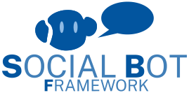

<p align="center">
  
</p>
<p align="center">
        <a href="https://github.com/rwth-acis/Social-Bot-Framework/blob/master/LICENSE">
            
        </a>
        <a href="https://github.com/rwth-acis/Social-Bot-Framework/releases">
        
    </a>
</p>

A Web-based, model-driven framework for creating social bots for RESTful web applications. Check out the [wiki](https://github.com/rwth-acis/Social-Bot-Framework/wiki) for more information about the modeling language and tutorials on creating bots with the framework.

## Core Components

* [las2peer-Social-Bot-Manager-Service](https://github.com/rwth-acis/las2peer-Social-Bot-Manager-Service)

## External Dependencies

* [y-websockets-server](https://github.com/y-js/y-websockets-server)
* [SyncMeta](https://github.com/rwth-acis/syncmeta)
* [MobSOS Data-Processing](https://github.com/rwth-acis/mobsos-data-processing)
* [MobSOS Success-Modeling](https://github.com/rwth-acis/mobsos-success-modeling)
* [Rasa](https://github.com/RasaHQ/rasa.git) 


(Note that the markdown format is only supported until versions < 2.8.21, later releases only accept the yaml format)

# SBF Utilities Frontend

This application provides helpers to interact with the Social Bot Manager service.

This frontend consists of the Bot Modeling and the NLU Model Training Helper.

# Getting started

The easiest way to get started is to use docker compose. 
In case you are using an M1 Mac, you need to add the following line to the `.env` file (create it if it does not exist):
```txt
RASA_IMAGE=khalosa/rasa-aarch64:3.5.2 
```
Then, run the following command:
```bash
docker-compose up
```
This will start the following services:
* social-bot-manager-service
* y-websockets-server
* mysql
* rasa 
* social-bot-framework-frontend

The frontend will be accessible via `http://localhost:8082`. 
## Run only the frontend 

You can also run only the frontend. 
Use `npm install` to install the required dependencies.
Run `vite` to start the server. The application will be served on `http://localhost:8082`.

The application is using [YJS][yjs-github] for interwidget communication, therefore it needs [y-websocket-server][y-websocket-server] instance.
It can be started with the following command:

```bash
$ docker run -p 1234:1234  -d lakhoune/y-websocket:latest
```

## Confguration

If you are using docker compose, you can configure the environment by adjusting the `.env` file.
The following environment variables can be configured. 
| Variable  | Meaning   | Default  | Required |
|---        |---        |---       |---       |
|OIDC_CLIENT_ID|  OIDC client id which is used for authentication purposes. The client id can be acquired from Learning Layers after client registration    | localtestclient  |  Yes |
|YJS        |The adress of the yjs instance.    | localhost:1234  | Yes|
|YJS_RESOURCE_PATH | If the WebSocket server is running behind a reverse proxy and the /yjs path is redirected to the WebSocket server, this env variable needs to be /yjs/socket.io. | | No| 
| YJS_PROTOCOL | The protocol used to connect to the WebSocket server. | ws | No |
| RASA_NLU  | Address of a server hosting the NLU Model. If not empty, the given address will be written in the "Rasa NLU Endpoint" field of the NLU Model Training Helper.  | http://rasa:5005 |   No |
|SBF_MANAGER| Address of a running SBFManager Instance. If not empty, the given address will be written in the "SBFManager Endpoint" fields of the frontend. | http://localhost:8080/SBFmanager |No|
| PORT | Port on which the frontend will be served. | 8082 | No |
|CONTACT_SERVICE_URL | URL at which the contact service is reachable | http://localhost:8080/contactservice | No |


## Bots created using this framework

| Bot            | Description                                                                                                                                                                                  | Application                                                                                                                                                | Demo                                                                                 |
| -------------- | -------------------------------------------------------------------------------------------------------------------------------------------------------------------------------------------- | ---------------------------------------------------------------------------------------------------------------------------------------------------------- | ------------------------------------------------------------------------------------ |
| MensaBot       | Bot used to fetch and rate menu for canteens.                                                                                                                                                | [las2peer-Mensa-Service](https://github.com/rwth-acis/las2peer-Mensa-Service)                                                                              | [Telegram](https://t.me/AcisMensaBot)                                                |
| SurveyBot      | Conducts surveys in chat, including getting the survey information, sending reminders and passing user results back to the survey instance.                                                  | [Survey-Handler-Service](https://github.com/rwth-acis/Survey-Handler-Service), [MobSOS Surveys](https://github.com/rwth-acis/mobsos-surveys) or LimeSurvey | [Rocket.Chat](https://chat.tech4comp.dbis.rwth-aachen.de/direct/surveybot)            | [Rocket.Chat](https://chat.tech4comp.dbis.rwth-aachen.de/direct/la-verification-bot) |
| FeedBot        | Gives out assignments to users, takes in their written solution and utilizes T-MITOCAR to compare it with a master solution. Does not give a grade but returns a feedback file where the comparison is discussed. | [las2peer-T-MITOCAR-Service](https://github.com/rwth-acis/las2peer-tmitocar-service)                                                                       | [Rocket.Chat](https://chat.tech4comp.dbis.rwth-aachen.de/direct/BiWi-FeedBot)        |
| ReaderbenchBot | Gives out assignments to users, takes in their written solution and utilizes Readerbench to compare it with a master solution. Does not give a grade but returns a feedback file where the comparison is discussed.                                                                                                                                                                                         | [las2peer-readerbench](https://github.com/rwth-acis/las2peer-readerbench)                                                                                  | [Rocket.Chat](https://chat.tech4comp.dbis.rwth-aachen.de/direct/readerbot)           |
| LitBot         | Supports students with reading seminar texts. Conducts small exercises with students and proposes additional tips, tools and learning material for before and after reading the texts. Also does recommendations based on the read texts.                                                                                                                                                                                        | [las2peer-akg](https://github.com/rwth-acis/las2peer-akg)                                                                                                  | [Rocket.Chat](https://chat.tech4comp.dbis.rwth-aachen.de/direct/BiWi-LitBot)         |
| LA-Bot         | Verifies a student's consent and manages it via blockchain. Continuing learner activities are verified and can be queried.                                                                                                                                                                                         | [learning-analytics-verification](https://github.com/rwth-acis/learning-analytics-verification)                                                            | [Rocket.Chat](https://chat.tech4comp.dbis.rwth-aachen.de/direct/la-verification-bot) |
| CitBot         | Finds references for text passages or for keywords. Manages marked literature and offers an export.                                                                                                                                                                                         | [Citation-Recommendation-Bot](https://github.com/rwth-acis/Citation-Recommendation-Bot)                                                                    | Slack - Contact us                                                                                 |

## Deploying a Bot

After creating a bot model on the frontend, you will be able to upload the bot to the SBFManager by using the "Model Uploader" on the "Bot Modeling" page. For this to work, you will need a running instance of the [SBFManager](https://github.com/rwth-acis/las2peer-Social-Bot-Manager-Service) and adjust the "SBFManager Endpoint" accordingly.

When creating chatbots you will also need to provide a [Rasa server](https://github.com/RasaHQ/rasa.git) hosting an NLU Model. You can also use the "NLU Model Training Helper" to create your own NLU Model and upload that model by adjusting the "SBFManager Endpoint" and "Rasa NLU Endpoint" accordingly.

To find out how to model bots, you can check the [SBF wiki](https://github.com/rwth-acis/Social-Bot-Framework/wiki).

## References

1. Neumann, Alexander Tobias, Tamar Arndt, Laura Köbis, Roy Meissner, Anne
Martin, Peter de Lange, Norbert Pengel, Ralf Klamma, and Heinz-Werner
Wollersheim. 2021. “Chatbots as a Tool to Scale Mentoring Processes:
Individually Supporting Self-Study in Higher Education.” *Frontiers in
Artificial Intelligence* 4: 64–71.
<https://doi.org/10.3389/frai.2021.668220>.

2. Neumann, Alexander Tobias, Peter de Lange, Ralf Klamma, Norbert Pengel,
and Tamar Arndt. 2021. “Intelligent Mentoring Bots in Learning
Management Systems: Concepts, Realizations and Evaluations.” In
*Learning Technologies and Systems*, edited by Chaoyi Pang, Yunjun Gao,
Guanliang Chen, Elvira Popescu, Lu Chen, Tianyong Hao, Bailing Zhang,
Silvia Margarita Baldiris Navarro, and Qing Li, 12511:3–14. Lecture
Notes in Computer Science. \[S.l.\]: Springer.
[https://doi.org/10.1007/978-3-030-66906-5_1](https://doi.org/10.1007/978-3-030-66906-5_1).

3. Neumann, Alexander Tobias, Peter de Lange, and Ralf Klamma. 2019.
“Collaborative Creation and Training of Social Bots in Learning
Communities.” In *2019 IEEE 5th International Conference on
Collaboration and Internet Computing (CIC)*, 11–19. IEEE.
<https://doi.org/10.1109/CIC48465.2019.00011>.
